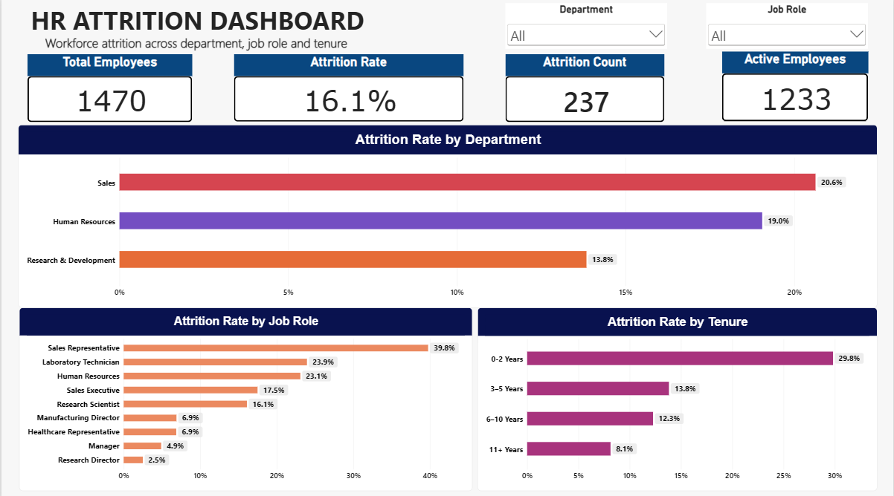
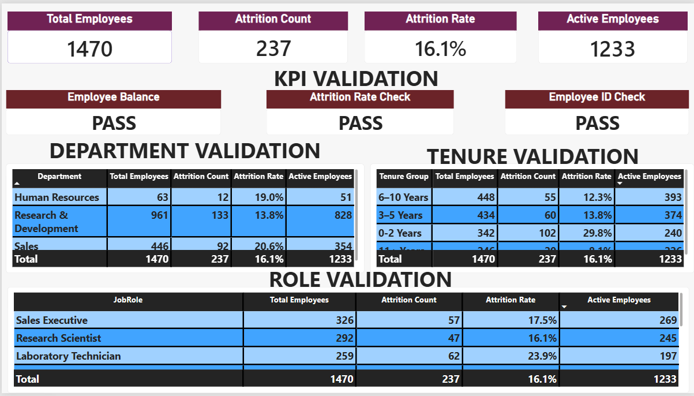

# HR Attrition Dashboard — Day 20 Internship Task

A professional **Power BI HR Attrition Dashboard** built as part of my Day 20 Data Analytics internship task using the **IBM HR Analytics** dataset.

The project focuses on turning employee attrition data into management-friendly insights across **department, job role, and tenure**, while keeping the report aggregated and documenting the development process for auditability.

> **Tool used:** Power BI only

---

## Project Objective

Build a management-ready dashboard that answers:

- How many employees are represented in the dataset?
- How many employees have left the organization?
- What is the overall attrition rate?
- Which departments have higher observed attrition rates?
- Which job roles show higher observed attrition rates?
- How does attrition vary by tenure group?

The internship task also emphasized using **rates rather than counts alone** and protecting sensitive HR details.

---

## Dataset

**Dataset:** IBM HR Analytics Employee Attrition & Performance

The dashboard uses employee-level HR attributes to calculate aggregated KPIs and segment-level attrition rates.

### Main analytical fields

- `EmployeeNumber`
- `Attrition`
- `Department`
- `JobRole`
- `YearsAtCompany`

Supporting dimensions can include fields such as `JobLevel`, `BusinessTravel`, and other available workforce attributes where appropriate.

> **Privacy note:** Employee-level identifiers and individual employee records are not exposed in the management dashboard visuals.

---

## Power BI Workflow

The project was completed entirely in Power BI using the following workflow:

```text
IBM HR Analytics Dataset
          ↓
     Power Query
          ↓
 Data inspection & cleaning
          ↓
    Tenure grouping
          ↓
      DAX measures
          ↓
    Dashboard visuals
          ↓
     Validation page
          ↓
      Audit Log page
```

### Power Query

Power Query was used for:

- Data inspection
- Data-type validation
- Data-quality checks
- Tenure-band creation
- Tenure sorting
- Transparent transformation tracking through Applied Steps

### DAX

Core measures created for the report:

```DAX
Total Employees =
DISTINCTCOUNT('HR Analytics'[EmployeeNumber])
```

```DAX
Attrition Count =
CALCULATE(
    [Total Employees],
    'HR Analytics'[Attrition] = "Yes"
)
```

```DAX
Active Employees =
[Total Employees] - [Attrition Count]
```

```DAX
Attrition Rate =
DIVIDE(
    [Attrition Count],
    [Total Employees],
    0
)
```

---

## Tenure Analysis

`YearsAtCompany` was grouped into four analytical bands:

| Tenure Group | Sort Order |
|---|---:|
| 0–2 Years | 1 |
| 3–5 Years | 2 |
| 6–10 Years | 3 |
| 11+ Years | 4 |

A numeric **Tenure Sort** field was used to ensure the categories appear in chronological order rather than alphabetically.

---

## Dashboard Structure

The Power BI report contains three main pages:

### 1. HR Attrition Dashboard

Management-facing overview containing:

- Total Employees
- Attrition Count
- Attrition Rate
- Active Employees
- Attrition Rate by Department
- Attrition Rate by Job Role
- Attrition Rate by Tenure
- Department slicer
- Job Role slicer

### 2. Validation

A QA page used to validate:

- Core KPI calculations
- Employee balance
- Attrition-rate calculation
- Employee-ID uniqueness
- Department-level values
- Role-level values
- Tenure-level values

### 3. Audit Log

A documentation page recording:

- Step ID
- Project stage
- Action performed
- Power BI feature used
- Transformation or measure
- Reason for the decision
- Expected result
- Validation method
- Status

---

## Key Dashboard Results

The completed dashboard currently shows:

| KPI | Result |
|---|---:|
| Total Employees | **1,470** |
| Attrition Count | **237** |
| Active Employees | **1,233** |
| Attrition Rate | **16.1%** |

The KPI validation page confirms:

```text
1,470 = 237 + 1,233

237 / 1,470 ≈ 16.1%
```

Both checks are marked **PASS** in the validation page.

---

## Observed Dashboard Insights

The current dashboard visuals show the following observed patterns:

### Department

- **Sales:** 20.6% attrition rate
- **Human Resources:** 19.0%
- **Research & Development:** 13.8%

### Job Role

The dashboard shows the highest observed role-level attrition rate for:

- **Sales Representative:** 39.8%
- **Laboratory Technician:** 23.9%
- **Human Resources:** 23.1%
- **Sales Executive:** 17.5%
- **Research Scientist:** 16.1%

Other displayed roles have lower observed rates.

### Tenure

The dashboard shows a clear difference across tenure bands:

- **0–2 Years:** 29.8%
- **3–5 Years:** 13.8%
- **6–10 Years:** 12.3%
- **11+ Years:** 8.1%

These observations describe the values visible in the completed dashboard; they should not be treated as causal explanations for why employees leave.

---

## Validation Approach

The validation page was created as an internal QA layer rather than another management dashboard.

### KPI validation checks

- Employee Balance: **PASS**
- Attrition Rate Check: **PASS**
- Employee ID Check: **PASS**

### Department validation

The validation table contains:

- Department
- Total Employees
- Attrition Count
- Attrition Rate
- Active Employees

### Role validation

The validation table contains:

- Job Role
- Total Employees
- Attrition Count
- Attrition Rate
- Active Employees

### Tenure validation

The validation table contains:

- Tenure Group
- Total Employees
- Attrition Count
- Attrition Rate
- Active Employees

The validation page is intended to make the dashboard calculations reviewable before final submission.

---

## Auditability

The project maintains an audit trail through two complementary mechanisms:

### Power BI native history

Power Query **Applied Steps** provide the detailed transformation history for data preparation.

### Project Audit Log

The report's Audit Log page summarizes important project actions and decisions. The current audit log screenshot contains **8 audit steps**, with **8 completed** and none currently marked in progress or under review.

Example logged stages include:

1. Report structure creation
2. IBM HR dataset import
3. Data-type checking
4. Total Employees DAX measure
5. Attrition Rate DAX measure
6. Tenure-band creation
7. Department visualization
8. Slicer / cross-filter testing

---

## Privacy & Data Protection

Because this is an HR analytics project, the dashboard is intentionally aggregated.

The management-facing report does not expose:

- Employee names
- Employee IDs
- Individual employee records
- Personal contact information
- Other unnecessary employee-level identifying details

The analysis focuses on groups and rates rather than individual employees.

---

## Dashboard Screenshots

### Main Dashboard



### Validation Page



### Audit Log Page


---

## Suggested Repository Structure

```text
HR-Attrition-Dashboard/
│
├── README.md
├── assets/
│   ├── dashboard.png
│   ├── validation.png
│   └── audit-log.png
|-----docs/Day-20-Internship Report.pdf
└── powerbi/
    └── HR_Attrition_Dashboard.pbix
```

> Do not commit raw employee-level HR data to a public repository. Keep the dataset local unless you have permission to redistribute it.

---

## Tools & Skills Demonstrated

- Power BI Desktop
- Power Query
- DAX
- Data Cleaning
- Data Validation
- KPI Development
- Attrition Rate Analysis
- Segmentation Analysis
- Dashboard Design
- Interactive Slicers
- Data Quality Checks
- Audit Documentation
- Privacy-aware HR Reporting

---
### Project Explanation

> I built an HR Attrition Dashboard in Power BI using the IBM HR Analytics dataset. I used Power Query for data preparation and tenure grouping, then created DAX measures for total employees, attrition count, active employees, and attrition rate. The dashboard compares attrition across departments, job roles, and tenure groups using interactive slicers. I also created a validation page to verify the KPI calculations and a separate audit log page to document the major transformations, measures, validation checks, and dashboard decisions. Because the project uses HR data, the final report focuses on aggregated insights and avoids exposing individual employee information.

---

## Status

**Day 20 — HR Attrition Dashboard: Completed**

The current Power BI deliverables include the management dashboard, validation page, and audit log page shown in the project screenshots above.


LINKEDIN : [link](https://lnkd.in/p/dGbkf87P)